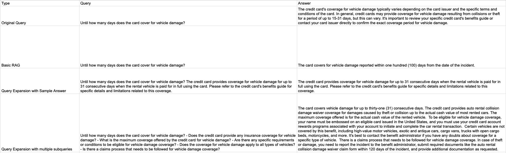

# Retrieval Augmented Generation for Credit Card Policies

This repository implements a **Retrieval-Augmented Generation (RAG)** framework designed to enhance Large Language Model (LLM) performance in answering customer queries related to credit card policies. The solution retrieves relevant documents from a vector database using embeddings and generates a context-aware response via **ChatGPT Turbo 3.5**. This case study particularly focuses on the credit card policy for Chase Sapphire.

## Reference
This project was completed as a hands-on implementation of concepts learnt in **Udemy course**: [Master RAG: Retrieval-Augmented Generation Systems](https://www.udemy.com/course/retrieval-augmented-gen/), which covers the principles and applications of RAG frameworks. Certification from the course is included in this repository.

---

## Problem Statement
In business contexts, customers frequently inquire about credit card policies, and providing accurate, contextually relevant answers in real-time is critical. Traditional LLMs, while powerful, may struggle with grounding responses in specific business knowledge, leading to inaccuracies.

This project enhances LLM performance using **Retrieval-Augmented Generation (RAG)**. By integrating a document retrieval system, we can ensure that answers are both contextually relevant and grounded in the business's internal policy documents.

---

## Methodology

### 1. **LangChain** is used to split the credit card policy documents into smaller text chunks. This is done via **Character Splitter** and **Sentence Transformer Token Text Splitter**, ensuring each text chunk is appropriately sized for LLM ingestion.

### 2. **ChromaDB** is employed to store the embeddings generated from the policy documents. Embeddings provide a vectorized representation of the text, allowing for efficient retrieval of relevant information based on a user's query.

### 3. For any incoming customer query, the **RAG framework** retrieves the most relevant document chunks from ChromaDB and passes them to **ChatGPT Turbo 3.5**, which generates a contextually relevant answer.

### 4. **Query Expansion via Sample Answer Generation**
- To improve retrieval accuracy, the project includes **query expansion** by generating sample answers. This ensures that queries are more precise, increasing the relevance of retrieved documents.

### 5. **Query Expansion via Subquery Generation**
- Another level of query expansion is implemented by breaking down customer queries into multiple subqueries, further enhancing the ability to retrieve pertinent information.

### 6. **Re-ranking of relevant documents using a Cross Encoder**
- Retrieved documents are reranked using a Cross Encoder for providing better context to the LLM.

### 7. The results are compiled and presented in a **dataframe** format, with relevant policy documents and generated answers. Below is a screenshot of the result compilation:

---

## Ongoing Improvements

1. Conduct analysis on multiple queries and evaluate the framework using the RAGAS metrics
2. **Dense Passage Retrieval**: Implement Dense Passage Retrieval (DPR) for better performance in finding relevant document chunks using dense embeddings.
4. Enhancing the framework to accomodate any credit card policy

---
